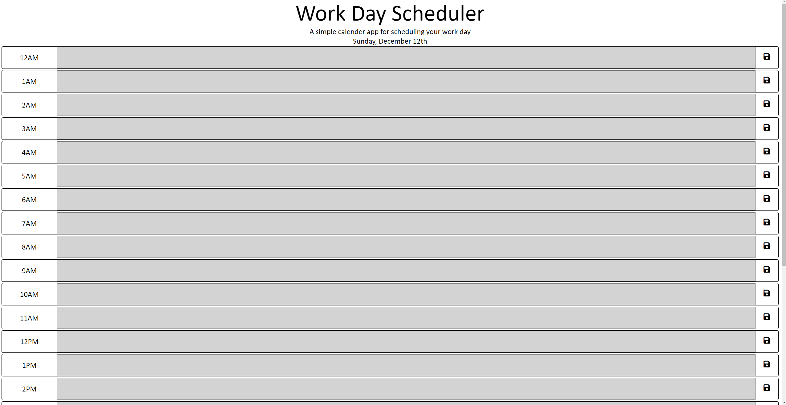

# Work-Day-Schedule

## Description
Work Day Schedule is a project that involves creating a website that allows the user to select a date and time and write a note into a time slot about what they plan to do at that point in their day.

## Link To Deployed Site
[Work Day Schedule](https://akcashing.github.io/Work-Day-Schedule/)
